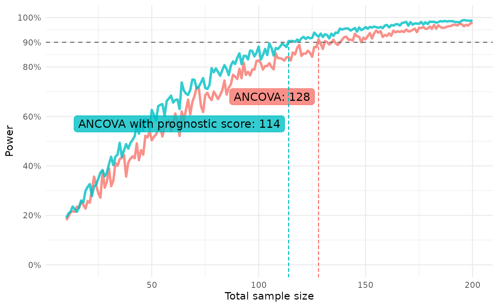

# Introduction to postcard

Setup-chunk to load the package, set a seed and turn off verbosity for
the rendering of the vignette.

``` r

library(postcard)
withr::local_seed(1395878)
withr::local_options(list(postcard.verbose = 0))
```

postcard provides tools for accurately estimating marginal effects using
plug-in estimation with GLMs, including increasing precision using
prognostic covariate adjustment. See [Powering RCTs for marginal effects
with GLMs using prognostic score
adjustment](https://arxiv.org/abs/2503.22284) by Højbjerre-Frandsen et.
al (2025).

## Plug-in estimation of marginal effects and variance estimation using influence functions

The use of plug-in estimation and influence functions can help us obtain
more accurate estimates. Coupled with prognostic covariate adjustment,
we can increase the precision of our estimates and obtain a higher power
with sacrificing control over the type I error rate.

Introductory examples on the use of
[`rctglm()`](https://novonordisk-opensource.github.io/postcard/reference/rctglm.md)
and
[`rctglm_with_prognosticscore()`](https://novonordisk-opensource.github.io/postcard/reference/rctglm_with_prognosticscore.md)
functions are available here. For more details, see
[`vignette("model-fit")`](https://novonordisk-opensource.github.io/postcard/articles/model-fit.md).

### Simulating data for exploratory analyses

First, we simulate some data to be able to enable showcasing of the
functionalities. For this we use the
[`glm_data()`](https://novonordisk-opensource.github.io/postcard/reference/glm_data.md)
function from the package, where the user can specify an expression
alongside variables and a family of the response to then simulate a
response from a GLM with linear predictor given by the expression
provided.

``` r

n <- 1000
b0 <- 1
b1 <- 3
b2 <- 2

# Simulate data with a non-linear effect
dat_treat <- glm_data(
  Y ~ b0+b1*log(W)+b2*A,
  W = runif(n, min = 1, max = 100),
  A = rbinom(n, 1, prob = 1/2),
  family = gaussian() # Default value
)
```

### Fitting `rctglm()` without prognostic covariate adjustment

The
[`rctglm()`](https://novonordisk-opensource.github.io/postcard/reference/rctglm.md)
function estimates any specified estimand using plug-in estimation for
randomised clinical trials and estimates the variance using the
influence function of the marginal effect estimand.

The interface of
[`rctglm()`](https://novonordisk-opensource.github.io/postcard/reference/rctglm.md)
is similar to that of the
[`stats::glm()`](https://rdrr.io/r/stats/glm.html) function but with an
added mandatory specification of

- `exposure_indicator`: The randomisation variable in data, usually
  being the (name of) the treatment variable
- `exposure_prob`: The randomisation ratio - the probability of being
  allocated to group 1 (rather than 0)
  - As a default, a ratio of 1’s in data is used
- `estimand_fun`: An estimand function
  - As a default, the function takes the average treatment effect (ATE)
    as the estimand

Thus, we can estimate the ATE by simply writing the below:

> Note that as a default, `verbose = 2`, meaning that information about
> the algorithm is printed to the console. However, here we suppress
> this behavior. See more in
> [`vignette("model-fit")`](https://novonordisk-opensource.github.io/postcard/articles/model-fit.md).

``` r

ate <- rctglm(formula = Y ~ A * W,
              exposure_indicator = A,
              exposure_prob = 1/2,
              data = dat_treat,
              family = "gaussian") # Default value
```

This creates an `rctglm` object which prints as

``` r

ate
#> 
#> Object of class rctglm 
#> 
#> Call:  rctglm(formula = Y ~ A * W, exposure_indicator = A, exposure_prob = 1/2, 
#>     data = dat_treat, family = "gaussian")
#> 
#> Counterfactual control mean (psi_0=E[Y|X, A=0]) estimate: 12
#> Counterfactual active mean (psi_1=E[Y|X, A=1]) estimate: 13.93
#> Estimand function r: psi1 - psi0
#> Estimand (r(psi_1, psi_0)) estimate (SE): 1.932 (0.09479)
```

The structure of such an `rctglm` object is broken down in the
**`Value`** section of the documentation in
[`rctglm()`](https://novonordisk-opensource.github.io/postcard/reference/rctglm.md).

Methods available are `estimand` (or the shorthand `est`) which prints a
`data.frame` with and estimate of the estimand and its standard error. A
method for the generics `coef` and `predict` are also available that are
“shortcuts” to applying the corresponding methods to the underlying
`glm` fit.

``` r

est(ate)
#>   Estimate Std. Error
#> 1 1.931923 0.09478538
```

See more info in the documentation page
[`rctglm_methods()`](https://novonordisk-opensource.github.io/postcard/reference/rctglm_methods.md).

### Using prognostic covariate adjustment

The
[`rctglm_with_prognosticscore()`](https://novonordisk-opensource.github.io/postcard/reference/rctglm_with_prognosticscore.md)
function uses the
[`fit_best_learner()`](https://novonordisk-opensource.github.io/postcard/reference/fit_best_learner.md)
function to fit a prognostic model to historical data and then uses the
prognostic model to predict \\\begin{align} \mathbb{E}\[Y\|X,A=0\]
\end{align}\\

for all observations in the current data set. These *prognostic scores*
are then used as a covariate in the GLM when running
[`rctglm()`](https://novonordisk-opensource.github.io/postcard/reference/rctglm.md).

Allowing the use of complex non-linear models to create such a
prognostic score allows utilising information from potentially many
variables, “catching” non-linear relationships and then using all this
information in the GLM model using a single covariate adjustment.

We simulate some historical data to showcase the use of this function as
well:

``` r

dat_notreat <- glm_data(
  Y ~ b0+b1*log(W),
  W = runif(n, min = 1, max = 100),
  family = gaussian # Default value
)
```

The call to
[`rctglm_with_prognosticscore()`](https://novonordisk-opensource.github.io/postcard/reference/rctglm_with_prognosticscore.md)
is the same as to
[`rctglm()`](https://novonordisk-opensource.github.io/postcard/reference/rctglm.md)
but with an added specification of

- (Historical) data to fit the prognostic model using
  [`fit_best_learner()`](https://novonordisk-opensource.github.io/postcard/reference/fit_best_learner.md)
- A formula used when fitting the prognostic model
  - Default uses all covariates in the data.
- (Optionally) number folds in cross validation and a list of learners
  for fitting the best learner

Thus, a simple call which estimates the average treatment effect,
adjusting for a prognostic score, is seen below:

``` r

ate_prog <- rctglm_with_prognosticscore(
  formula = Y ~ A * W,
  exposure_indicator = A,
  exposure_prob = 1/2,
  data = dat_treat,
  family = gaussian(link = "identity"), # Default value
  data_hist = dat_notreat)
```

Quick results of the fit can be seen by printing the object:

``` r

ate_prog
#> 
#> Object of class rctglm_prog 
#> 
#> Call:  rctglm_with_prognosticscore(formula = Y ~ A * W, exposure_indicator = A, 
#>     exposure_prob = 1/2, data = dat_treat, family = gaussian(link = "identity"), 
#>     data_hist = dat_notreat)
#> 
#> Counterfactual control mean (psi_0=E[Y|X, A=0]) estimate: 11.97
#> Counterfactual active mean (psi_1=E[Y|X, A=1]) estimate: 13.95
#> Estimand function r: psi1 - psi0
#> Estimand (r(psi_1, psi_0)) estimate (SE): 1.975 (0.06427)
```

It’s evident that in this case where there is a non-linear relationship
between the covariate we observe and the response, adjusting for the
prognostic score reduces the standard error of our estimand
approximation by quite a bit.

#### Investigating the prognostic model

Information on the prognostic model is available in the list element
`prognostic_info`, which the method
[`prog()`](https://novonordisk-opensource.github.io/postcard/reference/prog.md)
can be used to extract. A breakdown of what this list includes, see the
**`Value`** section of the
[`rctglm_with_prognosticscore()`](https://novonordisk-opensource.github.io/postcard/reference/rctglm_with_prognosticscore.md)
documentation.

## Prospective power approximation

In cases of seeking to conduct new studies, sample size/power analyses
are vital to the successful planning of such studies. Here, we present
implementations in this package that take advantage of power
approximation formulas to perform analyses.

See a more detailed walkthrough of a use case in
[`vignette("prospective-power")`](https://novonordisk-opensource.github.io/postcard/articles/prospective-power.md).

### For marginal effects

The method proposed in [Powering RCTs for marginal effects with GLMs
using prognostic score adjustment](https://arxiv.org/abs/2503.22284) by
Højbjerre-Frandsen et. al (2025) is a method to estimate the power of
any marginal effect, which is robust to misspecification. The method
works for prospective power estimation, performing an analysis only
using data of control participants. This is implemented in the function
[`power_marginaleffect()`](https://novonordisk-opensource.github.io/postcard/reference/power_marginaleffect.md).

According to the conservative approach in the article, if wanting to
conduct power analyses to figure out how many participants is needed for
an upcoming trial, where you are planning to use *prognostic score
adjustment*, predictions should be obtained from a discrete super
learner identical to the one planned to use for generating prognostic
scores when adjusting in the analysis when estimating the marginal
effect.

Here we showcase the use of a
[`glm()`](https://rdrr.io/r/stats/glm.html) as well as a discrete super
learner prognostic model fit with
[`fit_best_learner()`](https://novonordisk-opensource.github.io/postcard/reference/fit_best_learner.md).
We create the model and predict on the same data for simplicity of the
example, but you could add steps to get out-of-sample (OOS) predictions
(see examples).

``` r

ancova <- glm(Y ~ W, data = dat_notreat)
preds_anc <- predict(ancova, dat_notreat)
lrnr <- fit_best_learner(list(mod = Y ~ W), data = dat_notreat)
preds_dsl <- dplyr::pull(predict(lrnr, new_data = dat_notreat))

power_marginaleffect(
  response = dat_notreat$Y,
  predictions = preds_anc,
  target_effect = 0.3,
  exposure_prob = 1/2
)
#> [1] 0.471485
#> attr(,"samplesize")
#> [1] 1000
#> attr(,"target_effect")
#> [1] 0.3
#> attr(,"exposure_prob")
#> [1] 0.5
#> attr(,"estimand_fun")
#> function (psi1, psi0) 
#> psi1 - psi0
#> <bytecode: 0x558be47664e0>
#> <environment: 0x558bebd1c3d0>
#> attr(,"margin")
#> [1] 0
#> attr(,"alpha")
#> [1] 0.05
power_marginaleffect(
  response = dat_notreat$Y,
  predictions = preds_dsl,
  target_effect = 0.3,
  exposure_prob = 1/2
)
#> [1] 0.5592126
#> attr(,"samplesize")
#> [1] 1000
#> attr(,"target_effect")
#> [1] 0.3
#> attr(,"exposure_prob")
#> [1] 0.5
#> attr(,"estimand_fun")
#> function (psi1, psi0) 
#> psi1 - psi0
#> <bytecode: 0x558be47664e0>
#> <environment: 0x558bebc536a0>
#> attr(,"margin")
#> [1] 0
#> attr(,"alpha")
#> [1] 0.05
```

Note that the power is greater for the model that can account for the
non-linear effect of the covariate on the response.

### For linear models

The functions described in the help page
[`power_linear()`](https://novonordisk-opensource.github.io/postcard/reference/power_linear.md)
provide utilities for prospective power calculations using linear
models. We conduct sample size calculations by constructing power curves
using a **standard ANCOVA method** as described in (Guenther WC. Sample
Size Formulas for Normal Theory T Tests. The American Statistician.
1981;35(4):243–244) and (Schouten HJA. Sample size formula with a
continuous outcome for unequal group sizes and unequal variances.
Statistics in Medicine. 1999;18(1):87–91).

We compare the resulting power for ANCOVA models that leverage
prognostic covariate adjustment and ones that don’t. We use the function
`variance_ancova` to estimate the entity \\\sigma^2(1-R^2)\\ in case of
a “standard” ANCOVA model adjusting for covariates in data, and in case
of an ANCOVA utilising **prognostic score adjustment** by adjusting for
the prognostic score as a covariate.

``` r

dat_notreat <- dplyr::mutate(dat_notreat, .pred = preds_dsl)

var_bound_ancova <- variance_ancova(Y ~ W, data = dat_notreat)
var_bound_prog <- variance_ancova(Y ~ W + .pred, data = dat_notreat)
```

We can then estimate the power for a certain sample size using
[`power_gs()`](https://novonordisk-opensource.github.io/postcard/reference/power_linear.md)
or
[`power_nc()`](https://novonordisk-opensource.github.io/postcard/reference/power_linear.md)
with an `n` specified, or we can use
[`samplesize_gs()`](https://novonordisk-opensource.github.io/postcard/reference/power_linear.md)
to estimate the sample size needed to obtain a certain `power`.

``` r

samplesize_gs(variance = var_bound_ancova,
              power = 0.9, r = 1, ate = .8, margin = 0)
#> [1] 148.6439
#> attr(,"power")
#> [1] 0.9
#> attr(,"target_effect")
#> [1] 0.8
#> attr(,"exposure_prob")
#> [1] 0.5
#> attr(,"estimand_fun")
#> function (psi1, psi0) 
#> psi1 - psi0
#> <bytecode: 0x558be47664e0>
#> <environment: 0x558bea06b298>
#> attr(,"margin")
#> [1] 0
#> attr(,"alpha")
#> [1] 0.05
samplesize_gs(variance = var_bound_prog,
              power = 0.9, r = 1, ate = .8, margin = 0)
#> [1] 66.3146
#> attr(,"power")
#> [1] 0.9
#> attr(,"target_effect")
#> [1] 0.8
#> attr(,"exposure_prob")
#> [1] 0.5
#> attr(,"estimand_fun")
#> function (psi1, psi0) 
#> psi1 - psi0
#> <bytecode: 0x558be47664e0>
#> <environment: 0x558bea0187e0>
#> attr(,"margin")
#> [1] 0
#> attr(,"alpha")
#> [1] 0.05
```

## Creating a plot of prospective power curves

To easily visualise how the estimated power behaves as a function of the
total sample size compared between models, functions
[`repeat_power_marginaleffect()`](https://novonordisk-opensource.github.io/postcard/reference/repeat_power_marginaleffect.md)
and
[`repeat_power_linear()`](https://novonordisk-opensource.github.io/postcard/reference/repeat_power_linear.md)
are available, which both produce S3 class objects with associated plot
methods.

> We will here describe and show an example for
> [`repeat_power_marginaleffect()`](https://novonordisk-opensource.github.io/postcard/reference/repeat_power_marginaleffect.md).
> While the arguments are slightly different, the idea behind
> [`repeat_power_linear()`](https://novonordisk-opensource.github.io/postcard/reference/repeat_power_linear.md)
> is exactly the same.

### Using `repeat_power_marginaleffect()` and plotting the results

The function has two arguments with non-default values. Like in
[`power_marginaleffect()`](https://novonordisk-opensource.github.io/postcard/reference/power_marginaleffect.md),
we need to specify our `target_effect` and an `exposure_prob`. Arguments
`model_list` and `test_data_fun` do have default values just to enable
an easy way for the user to inspect the output of the function, but
these are arguments the user will typically want to specified. These
arguments give a list of fitted models, which are used to create
predictions on the test data created for each sample size, which are
then passed to
[`power_marginaleffect()`](https://novonordisk-opensource.github.io/postcard/reference/power_marginaleffect.md).

The function also has arguments `ns`, `desired_power` and `n_iter`,
which are a vector of sample sizes to estimate the power for, the power
that is trying to be achieved, and a number of iterations to average the
results over, respectively.

Running the function specifying nothing but arguments with non-default
values, we estimate the power on data with the same structure as has
been used earlier in this vignette, with the response modelled by a
non-linear effect of a single covariate. We use a simple ANCOVA and a
prognostic model fitted with
[`fit_best_learner()`](https://novonordisk-opensource.github.io/postcard/reference/fit_best_learner.md)
as our models.

Thus, a simple use of
[`repeat_power_marginaleffect()`](https://novonordisk-opensource.github.io/postcard/reference/repeat_power_marginaleffect.md)
could look like this:

``` r

rpm <- repeat_power_marginaleffect(
  target_effect = 1.3, exposure_prob = 1/2,
  ns = 10:200, n_iter = 10
)
#> Estimating power across sample sizes `n_iter` times ■■■■                       …
#> Estimating power across sample sizes `n_iter` times ■■■■■■■                    …
#> Estimating power across sample sizes `n_iter` times ■■■■■■■■■■                 …
#> Estimating power across sample sizes `n_iter` times ■■■■■■■■■■■■■              …
#> Estimating power across sample sizes `n_iter` times ■■■■■■■■■■■■■■■■■■■        …
#> Estimating power across sample sizes `n_iter` times ■■■■■■■■■■■■■■■■■■■■■■     …
#> Estimating power across sample sizes `n_iter` times ■■■■■■■■■■■■■■■■■■■■■■■■■■■…
#> Estimating power across sample sizes `n_iter` times ■■■■■■■■■■■■■■■■■■■■■■■■■■■…
```

`rpm` is then a `data.frame` containing information on the estimated
power across the list of models for different sample sizes. It has the
class `postcard_rpm`, which has a plot method, enabling us to easily
plot the results.

``` r

plot(rpm)
```


