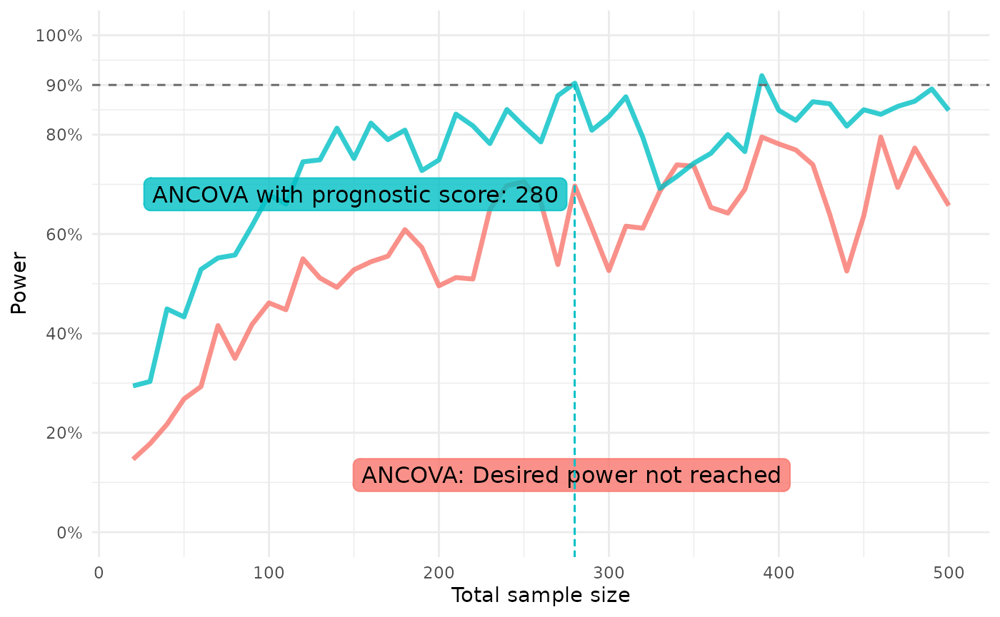

# Prospective Power Estimation

``` r

library(postcard)
withr::local_seed(1395878)
withr::local_options(list(postcard.verbose = 0))
```

## Estimating the power for marginal effects

The method proposed in [Powering RCTs for marginal effects with GLMs
using prognostic score adjustment](https://arxiv.org/abs/2503.22284) by
Højbjerre-Frandsen et. al (2025), which can be used to estimate the
power when estimating any marginal effect, is implemented in the
function
[`power_marginaleffect()`](https://novonordisk-opensource.github.io/postcard/reference/power_marginaleffect.md).

An introductory example is available in
[`vignette("postcard")`](https://novonordisk-opensource.github.io/postcard/articles/postcard.md),
but here we describe how to specify arguments to change the default
behavior of the function to align with assumptions for the power
estimation.

#### Simulating some data

We generate count data to showcase the flexibility of
[`power_marginaleffect()`](https://novonordisk-opensource.github.io/postcard/reference/power_marginaleffect.md)
that does not assume a linear model.

``` r

n_train <- 2000
n_test <- 200
b1 <- 0.9
b2 <- 0.2
b3 <- -0.4
b4 <- -0.6

train_pois <- glm_data(
    Y ~ b1*log(X1)+b2*X2+b3*X3+b4*X2*X3,
    X1 = runif(n_train, min = 1, max = 10),
    X2 = rnorm(n_train),
    X3 = rgamma(n_train, shape = 1),
    family = poisson()
  )
test_pois <- glm_data(
    Y ~ b1*log(X1)+b2*X2+b3*X3+b4*X2*X3,
    X1 = runif(n_test, min = 1, max = 10),
    X2 = rnorm(n_test),
    X3 = rgamma(n_test, shape = 1),
    family = poisson()
  )
```

### Controlling assumptions

As a default, the variance in group 0 is estimated from the sample
variance of the response, and the variance in group 1 is assumed to be
the same as the estimated variance in group 0. Use argument `var1` to
change the variance estimate in group 1, either with a function that
modifies the estimate obtained for group 0 or as a `numeric`. The same
is true for the MSE, where `kappa1_squared` as a default is taken to be
the same as the MSE in group 0 unless a `function` or `numeric` is
specified.

Below is an example showcasing the different ways to specify `var1` and
`kappa1_squared` used to adjust the assumptions according to prior
beliefs. In practice, if wanting to specify either of these arguments as
just a numeric, you will likely do a calculation on some historical
data, whereas here we just put some number to showcase.

> Note that we fit a prognostic model using
> [`fit_best_learner()`](https://novonordisk-opensource.github.io/postcard/reference/fit_best_learner.md)
> and use this as our prediction in accordance with the guidance in the
> main reference to obtain a conservative power estimate of estimating a
> marginal effect in a GLM that adjusts for the prognostic score as a
> covariate alongside other covariates.

``` r

lrnr <- fit_best_learner(list(mod = Y ~ X1 + X2 + X3), data = train_pois)
preds <- dplyr::pull(predict(lrnr, new_data = test_pois))

power_marginaleffect(
  response = test_pois$Y,
  predictions = preds,
  var1 = function(var0) 1.1 * var0,
  kappa1_squared = 2,
  estimand_fun = "rate_ratio",
  target_effect = 1.4,
  exposure_prob = 1/2,
  margin = 0.8
)
#> [1] 0.9871395
#> attr(,"samplesize")
#> [1] 200
#> attr(,"target_effect")
#> [1] 1.4
#> attr(,"exposure_prob")
#> [1] 0.5
#> attr(,"estimand_fun")
#> function (psi1, psi0) 
#> psi1/psi0
#> <bytecode: 0x5629c1e36c50>
#> <environment: 0x5629c1e36e48>
#> attr(,"margin")
#> [1] 0.8
#> attr(,"alpha")
#> [1] 0.05
```

The function
[`repeat_power_marginaleffect()`](https://novonordisk-opensource.github.io/postcard/reference/repeat_power_marginaleffect.md)
allows passing arguments along to
[`power_marginaleffect()`](https://novonordisk-opensource.github.io/postcard/reference/power_marginaleffect.md),
so we are able to quickly create power curves for the above case.

We define our models in a named list and define a function of a single
parameter - the sample size `n` - that simulates the test data with the
same structure as above but for different sample sizes.

``` r

ancova_prog_list <- list(
  ANCOVA = glm(Y ~ X1 + X2 + X3, data = train_pois, family = poisson),
  # "Null model" = glm(Y ~ 1, data = train_pois, family = poisson),
  "ANCOVA with prognostic score" = fit_best_learner(list(mod = Y ~ X1 + X2 + X3), data = train_pois)
)
test_pois_fun <- function(n) {
  glm_data(
    Y ~ b1*log(X1)+b2*X2+b3*X3+b4*X2*X3,
    X1 = runif(n, min = 1, max = 10),
    X2 = rnorm(n),
    X3 = rgamma(n, shape = 1),
    family = poisson()
  )
}
```

We then run the power estimation and plot the results:

``` r

rpm <- repeat_power_marginaleffect(
  model_list = ancova_prog_list,
  test_data_fun = test_pois_fun,
  ns = seq(20, 500, by = 10), n_iter = 20,
  var1 = function(var0) 1.1 * var0,
  kappa1_squared = function(kap0) 1.1 * kap0,
  estimand_fun = "rate_ratio",
  target_effect = 1.4,
  exposure_prob = 1/2,
  margin = 0.8
)
#> Estimating power across sample sizes `n_iter` times ■■■■                       …
#> Estimating power across sample sizes `n_iter` times ■■■■■■■■■■                 …
#> Estimating power across sample sizes `n_iter` times ■■■■■■■■■■■■■■■■           …
#> Estimating power across sample sizes `n_iter` times ■■■■■■■■■■■■■■■■■■■■■■     …
#> Estimating power across sample sizes `n_iter` times ■■■■■■■■■■■■■■■■■■■■■■■■■■■…
#> Estimating power across sample sizes `n_iter` times ■■■■■■■■■■■■■■■■■■■■■■■■■■■…

plot(rpm)
```


